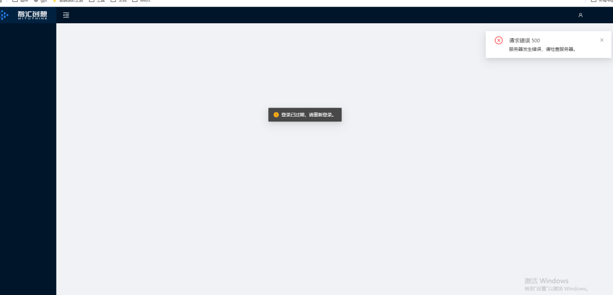
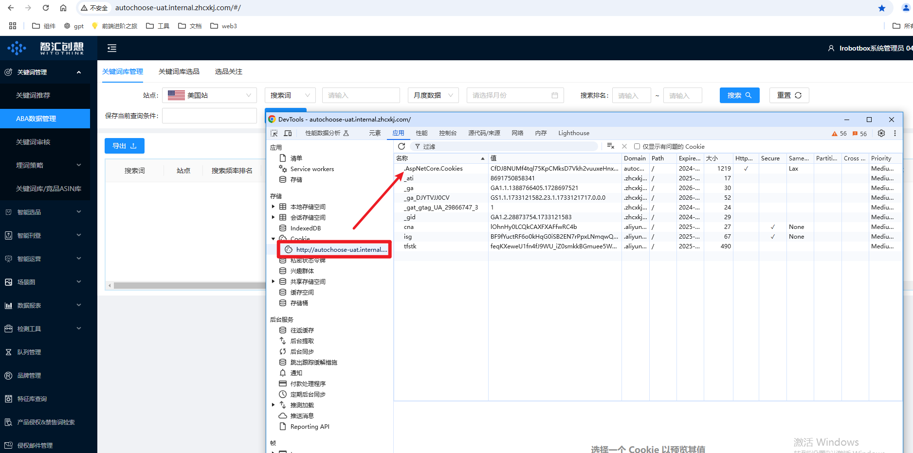

#  智能选品 npm start后 页面显示

# 需要先登录测试环境
http://sys-test.zhcxkj.com:8887/#/user/login?redirecturl=http%3A%2F%2Fautochoose-uat.internal.zhcxkj.com%3A%2Faccount%2Flogin%3Fauthorizetype%3DUnAuthorized%26redirecturl%3D%252Fhome%252F
# F12 应用-Cookie 把测试环境的.AspNetCore.Cookies拷贝去本地链接，页面即可正常展示

